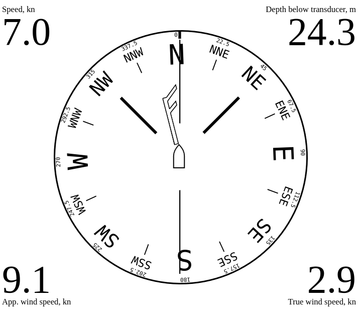

# E-InkDashboardExtended [License: CC BY-NC-SA 4.0](https://creativecommons.org/licenses/by-nc-sa/4.0/deed.en)
 Web application that shows in the browser the main parameters of the ship's movement received from the [SignalK](https://signalk.org/) server.  
 The application is aimed at mobile devices with e-ink screen (specifically Amazon Kindle) and does not require installation of any applications: the existing browser is sufficient.  
 Of course, the app also works in any more or less modern browser on any device with any screen size.
 Derived from [Vladimir Yurievich Kalachikhin's work](https://github.com/VladimirKalachikhin/e-inkDashboardModernSK), and optimized for sailing performance.

**WARNING! No information shown or not shown by this application may serve as a basis for an action or inaction of the shipmaster.**

## v. 0.5.4
Contents:  
- [Features](#features)
- - [Direction](#direction)
- - [Wind](#wind)
- - [Navigation](#navigation)
- - [In screen corners](#in-screen-corners)
- - [Data actuality](#data-actuality)
- [Requirements](#requirements)
- [Dependencies](#dependencies)
- [Installation](#installation)
- [Launch](#launch)
- [Support](#support)

## Features
If data are available, the following directions and values may be shown:

### Direction
One of the following values can be selected as the direction in the application configuration:

* Course over ground (COG)
* Course over ground magnetic (CGM)
* Heading true (HT)
* Heading magnetic (HM)
* Heading compass (HC)

The Course over ground is default value because this is commonly reported by the GPS receiver.

The vertical line indicates the course. The compass represent the heading. In case of leeway angle, the vertical line representing the course is rotated relative to ship/compass. 
The two 45 deg lines represent the tightest close haul angle.

### Wind
If wind speed and wind direction information is available, a wind indicator will be displayed. The symbols of the pointer corresponds to that used in meteorology: a short stroke means a wind speed of 2.5 m/sec, a long stroke means 5 m/sec, and a triangle means 25 m/sec. Thus, the illustration shows wind speeds greater than or equal to 7.5 but less than 10 m/sec.  
For your reference, the exact wind speed is indicated above the bottom edge of the screen.

One of the following values may be specified as the wind:

* Apparent wind (AW)
* True wind through water (TWA)
* True wind (TW)
* True wind magnetic (TWM)
* True wind through ground (GWA)
* none

The default value is the Apparent wind. Wind angle data is smoothed to avoid excessive jerking of the indicator on slow e-ink displays.

### Navigation
If there is information about the next navigation point, a direction indicator to that point will be displayed. If specified in the application configuration - the distance to a point will be displayed in one corner of the screen.  
The next navigation point will be displayed in any route mode, both when following the specified point and when following the route.

### In screen corners
One of the following values may be displayed in each of the four corners of the screen, if the SignalK server has the information:

* Speed over ground (SOG)
* Speed through water (STW)
* Depth below surface (DBS)
* Depth below keel (DBK)
* Depth below transducer (DBT)
* Apparent wind speed (AWS)
* True wind speed (TWS)
* Apparent wind angle (AWA)
* True wind angle (TWA)
* Engine 1 revolutions
* Engine 1 temperature
* Engine 2 revolutions
* Engine 2 temperature
* Outside air temperature
* Outside air pressure
* Outside air relative humidity
* Water temperature
* Next navigated point
* none

What exactly to show in each corner is determined in the application settings in the SignalK Administrative Interface.

A tap in the corner of the screen enlarges the display of the corresponding value. This can be useful for temporarily improving the readability of specific data in special situations.  
Tapping again returns the displaying to its normal size.

### Data actuality
The application keeps track of the actuality of the incoming data. If the incoming information is older than a certain period of time (different for each value), its display is stopped. When the current information is resumed, the display is resumed as well.

## Requirements
The web application requires a more or less modern browser (version not older than 5 years), and will not work in Internet Explorer browser. Some device performance and sufficient e-ink screen refresh rate are also required. However, all modern e-book type devices have the required features.

## Installation
e-inkdashboardextended is a SignalK web application (Webapps), and can be installed in the SignalK environment in the usual way from the Appstore in the SignalK Administrative Interface.

## Launch
In the SignalK Administration Interface, select Webapps -> E-InkDashboardExtended SignalK Edition  

## Support
Please submit bugs and feature requests to [Github](https://github.com/Yskaa91/e-inkDashboardExtended/issues)